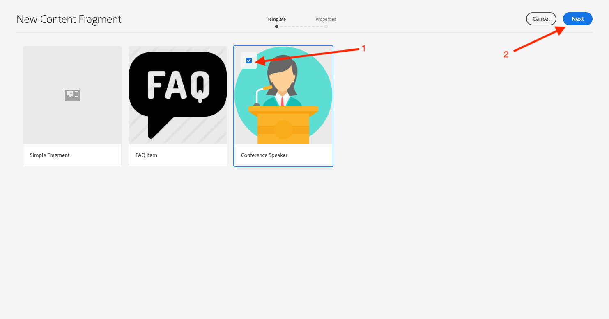
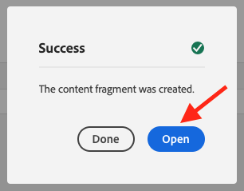
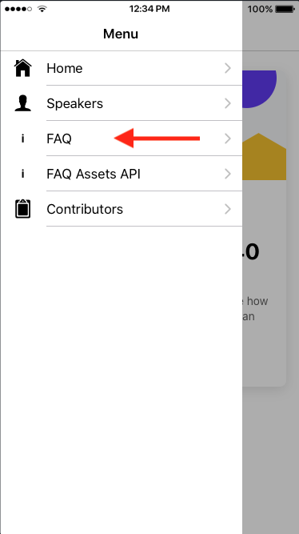

# L740 - Headless Architecture with Adobe Experience Manager

## Table of Contents

* [Lab Overview](#lab-overview)
* [Lesson 1 - Project Setup](#lesson-1---project-setup)
* [Lesson 2 - Content Fragments](#lesson-2---content-fragments-via-api-pages)
* [Lesson 3 - Assets HTTP API](#lesson-3---creating-a-campaign-for-our-promotion)
* [Lesson 4 - Sling Model Exporter](#lesson-3---creating-a-campaign-for-our-promotion)
* [Lesson 5 - Experience Fragments](#lesson-3---creating-a-campaign-for-our-promotion)
* [Additional Resources](#additional-resources)

## Lab Overview

Explore the myriad ways Adobe Experience Manager can expose its content in a headless fashion to a mobile and third-party application. Learn best practices, and get guidance on which approach is appropriate based on context.

### Key Takeaways

* Headless use cases for Content Fragments and Content Services.
* How to create Content Fragments from a Content Fragment Model Assets REST APIs for Content & Experience Fragments.
* How to leverage features in Content & Experience Fragments and Sling Model Exporter.

### Prerequisites

* High-level understanding of APIs and Mobile Apps
* Basic knowledge of JavaScript and JSON
* Basic knowledge of content authoring within AEM.
* Local instance of AEM 6.5 or greater.

# Lesson 1 - Project Setup

## Objective

1. Install the pre-requisite software.
2. Validate connectivity of Mobile App to AEM.

## Lesson Context

This lesson sets up the software for the remaining lessons. Most should already be installed and ready to execute; but validating its state is important to ensure remaining lessons are successful.

## Mobile Stack Overview
The Mobile App for this lab is built using the following technologies:

 * Ionic Framework: https://ionicframework.com a cross-platform UI Framework for building mobile apps.
 * Angular: https://angular.io JavaScript framework for building applications

> ***Note:*** ***Ionic Framework*** *also integrates with React as the JavaScript framework for the application. For the purposes of this lab we are using this mobile app to essentially act like any 3rd party application (mobile/desktop/IoT) that can consume content from Adobe Experience Manager*

### Exercise 1.1 - Install Initial Code and Content

> ***Note:*** This exercise is already completed and the initial code and content is already pre-built on these machines. This is specifically for those who might be running this lab at home and not directly in the lab*

Execute these commands to ensure that the code and content package are installed.

1. Open the *Terminal* application

2. Change the working directory to the `L740/summit-l740` folder:

```
$ cd ~/Desktop/L740/summit-l740
```

3. Install the AEM application code on both Author and Publish instances. Ensure that you have both Author and Publish running before executing this command.

```
$ mvn -PautoInstallPackage clean install

$ mvn -PautoInstallPackagePublish clean install
```  

### Exercise 1.2 - Validate Installed Software

Execute these commands to validate that the necessary software is installed.

1. Open the *Terminal* application.

2. Validate Node version.

  ```
  $ npm -v
  6.12.1
  ```

4. Validate Ionic

  ```
  $ ionic --version
  5.4.15
  ```

5. Navigate to the AEM to ensure AEM is up and running.

   - [http://localhost:4502/aem/start.html](http://localhost:4502/aem/start.html)
   - [http://localhost:4503/content/l740/us/en/api/speakers.html]](http://localhost:4503/content/l740/us/en/api/speakers.html])


### Exercise 1.3 - Preview the Mobile App

Follow these steps to run Ionic and preview the mobile app in your browser.

1. Change to the mobile app directory

```
$ cd ~/Desktop/L740/app/l740
```

2. Run the Ionic Preview Command

```
$ ionic serve --lab
```

3. Preview the Mobile App

Launching the lab should automatically open the browser to the Mobile preview. If it does not, use the bookmark *Headless Lab Ionic Preview*.

> ***Note:*** You can pick either ***iPhone***,  ***Android*** or ***Windows*** in the platforms dropdown on the top right of this page and view the app in that flavor. The Ionic Framework automatically attaches the appropriate icons & styling to suit the specific platform. Pick your favorite mobile platform and use that for the rest of this session. The screenshots in this workbook are based on the iOS platform preview.

You should now see the mobile app preview with five menu items as shown below:
<p align="center">
  
  &nbsp;&nbsp;&nbsp;&nbsp;&nbsp;
  
</p>

At this point you are ready to start working on the exercises for the lab. As changes are made in the Mobile App, the preview will reload automatically.


# Lesson 2 - Content Fragments via API Pages

## Objective

1. Learn how Content Services API pages deliver JSON content to the mobile app
2. Update the mobile app code to pull in new content fields from the AEM API Page
3. Create a new content fragment and preview that content in the mobile app.

## Lesson Context

This lesson covers headless delivery of content fragments built using the **Conference Speaker Content Fragment Model (CFM)** via Content Services API Pages.

Our Mobile App needs to display a list of conference speakers as shown below in the UX handed to us by our design team.

<p align="center">
  
</p>

Let's preview the Summit Speakers menu item in the mobile app. Compare this with what you see in the mobile app preview.

### Exercise 2.1 - Look at the content exposed from AEM
Let's take a look at the content in AEM and see how it is built out. We will work our way back from the JSON endpoint that the mobile app points to in AEM and look at how that is built out.

####  1. Summit Speakers JSON API Endpoint
This can be found in Line 12 of config.ts located in the following location from the project code root path:
  * ` app/l740/src/providers/config.ts `

Let's follow this URL and take a look at the JSON on the AEM Publish server
  * [http://localhost:4503/content/l740/us/en/api/speakers.model.json]()

> ***Pro Tip:*** Adding 'tidy' to the url will make the JSON easier to read if you don't already have browser add-ons to do that for you:
> [http://localhost:4503/content/l740/us/en/api/speakers.model.tidy.json]()

Note that the following pieces of information are being exposed in the JSON:

* Title
* Text
* Content Fragment List with multiple items with following elements:
    * Speaker Name
    * Speaker Byline
    * Speaker Image
    * Speaker Date of Birth

> ***Note:*** Even before Content Services existed, AEM was able to expose any content as JSON just by using the default .json extension. (Sling JSON Servlet) exposes a “raw” representation of the node, which can change over time / versions of AEM. In effect, the Sling JSON Servlet is effectively exposing the implementation details, and not necessarily a “stable” JSON API that can be consumed by other applications. Take a look for yourself at the difference between .json and .model.json for this particular page. Which do you think is more useful to consume in a 3rd party application?
> [http://localhost:4503/content/l740/us/en/api/speakers.4.json]()


####  2. Preview the Summit Speakers HTML page on AEM Publish using the following URL
Let's look at the actual AEM page that exposes this JSON
 * [http://localhost:4503/content/l740/us/en/api/speakers.html]()

> ***Note:*** Just by changing ".html" to ".model.json", we were able to expose all this information in the page in a well-structured JSON that our mobile app (or for that matter, any 3rd party application) can consume. Because we used Core Components on this page, there was no need to build any custom code to make this happen. A business user now has the ability to update this page and change content in the mobile app without writing a single line of code!


####  3. Open the same page in AEM Author using the following URL (in a new tab)
  * [http://localhost:4502/editor.html/content/l740/us/en/api/speakers.html]()

### Exercise 2.2 - Title Mania!

Let's update the title of this screen in the app. To do this, we need to perform the following steps:

* **Step 1:** Edit the Speakers page
* **Step 2:** Update the title of the page
* **Step 3:** Publish your changes
* **Step 4:** Preview the changes in the mobile app

####  1. Edit the Speakers page
To make any changes, you need to first be in Edit Mode in the Authoring interface

<p align="center">
  
</p>

####  2. Update the title of the page
Edit the Title component and update the value with something new.

<p align="center">
  
</p>

####  3. Publish your changes
From the top-left menu, publish your changes by clicking on "Publish Page" menu option as shown below:

<p align="center">
  
</p>

> ***Pro Tip:*** Mobile or any 3rd party apps should point to content in the Publish Tier and not Author Tier. Typically, you would have a Dispatcher and a Content Delivery Network on top of the Publish server, but in this lab we are just using the Publish server. We can still leverage all authoring capabilities and workflow before content becomes published like we would for a normal website running on AEM.


####  4. Preview your changes in the JSON & Mobile App

Look at the JSON and check if you can find your updated value
  * [http://localhost:4503/content/l740/us/en/api/speakers.model.json]()

    > ***Hint:*** You can search for your updated change in the JSON by using Command + F

Refresh the mobile app preview and navigate to the Conference Speakers menu item and take a look at your updated value there

<p align="center">
  
</p>


### Exercise 2.3 - Release the Images!
Looking at the app preview, we can see that the app is pulling in the following elements from content fragments in AEM:

* Speaker Name
* Speaker Byline
* Speaker Date of Birth

but it is not using

* Speaker Image

yet.

Let's fix the experience and pull in this additional piece of content to the mobile app. To do this, we need to perform the following steps:

* **Step 1:** Edit the Conference Speakers App Screen
* **Step 2:** Add images to the display of the mobile app screen
* **Step 3:** Preview the changes in the mobile app

#### 1. Edit the Conference Speakers App Page
This is located in the following location from the project code root path:
  * ` app/1740/src/app/conference-speakers/conference-speakers.page.html `

#### 2. Add images to the display of the mobile app screen
Uncomment Line 26. This line of code pulls in the right value from the Model JSON and adds it to the app screen.

<p align="center">
  
</p>

#### 3. Preview the Mobile App
Now you should see images show up in the mobile app when you navigate to the Conference Speakers Menu item as shown below:

<p align="center">
  
</p>


### Exercise 2.4 - Cute.. but let's release the *Right* Images!
Despite our personal preference for these images, let's now update the content fragments with the right images of the actual speakers.

#### Edit the Content Fragment by browsing to it from the Assets console in AEM
You can browse to the folder in the Assets console and edit the content fragments directly there as shown below:

* **Step 1:** Browse to the Assets console
* **Step 2:** Select Files View
* **Step 3:** Select Column View
* **Step 4:** Browse to the folder with the speaker content fragments
* **Step 5:** Edit the content fragment and update the image
* **Step 6:** Repeat the previous steps and update the images for all the remaining content fragments
* **Step 7:** Publish all content fragments
* **Step 8:** Preview the changes in the mobile app

#### 1. Browse to the Assets console:

<p align="center">
  
</p>

#### 2. Select Files View

<p align="center">
  
</p>

#### 3. Select Column View
>***Note:*** The fastest way around content in AEM is using column view. Select Column View in your view options as shown below:

<p align="center">
  
</p>


#### 4. Browse to the following path or use the following URL:
  * [http://localhost:4502/assets.html/content/dam/l740/conference-speakers]()

#### 5. Edit a content fragment and update the image

Update the Speaker Headshot by selecting the right image from the Digital Asset Manager (DAM) folder as shown below:

<p align="center">
  
</p>

<p align="center">
  
</p>

<p align="center">
  
</p>

>***Note:*** When selecting the image, please click on the thumbnail of the image and then click on "Select" button located in the top right corner of the modal.

Hit Save.

#### 6. Repeat the previous steps and update the images for all the remaining content fragments

#### 7. Quick Publish the content fragments
<p align="center">
  
</p>

#### 8. Preview the changes in the mobile app
Now you should see *right* images show up in the mobile app when you navigate to the Conference Speakers Menu item as shown below:

<p align="center">
  
</p>


### Exercise 2.5 - Everybody is a conference Speaker!!
Have you ever wanted to be a Conference Speaker?? Today is your lucky day! This activity involves the following steps:

* **Step 1:** Create a new speaker content fragment
* **Step 2:** Fill in your details and save the fragment
* **Step 3:** Publish the new speaker content fragment
* **Step 4:** Preview the Speakers API page
* **Step 5:** Preview the changes in the mobile app


#### 1. Create a new speaker content fragment

1. Browse to the conference speakers content fragment folder in the Assets console:
  * [http://localhost:4502/assets.html/content/dam/l740/conference-speakers]()

2. Create a new Speaker fragment based on the Conference Content Fragment Model

<p align="center">
  
</p>

<p align="center">
  
</p>

<p align="center">
  
</p>

<p align="center">
  
</p>

#### 2. Fill in your details and save the fragment

<p align="center">
  
</p>

<p align="center">
  
</p>

#### 3. Publish the new speaker content fragment
Make sure that your content fragment is selected. From the menu click on the "Quick Publish" menu option as shown below:

> ***Note:*** Based on your window size the menu with move some features into a dropdown menu. Click on the ellipsis to show more menu items.

<p align="center">
  
</p>

<p align="center">
  
</p>

#### 4. Preview the Speakers AEM page

1. Open the Speakers AEM Page
  * [http://localhost:4502/editor.html/content/l740/us/en/api/speakers.html]()

2. *Optional:* Change the speaker order. The Speakers AEM Page leverages the Content Fragment List component to display all of the content fragments in the Speaker folder. This component allows you change the order by property from alphabetical to created to display the newest speaker at the top.
<p align="center">
  
</p>
<p align="center">
  
</p>

Publish the page after updating the component to see your changes in the Mobile App
<p align="center">
  
</p>

#### 5. Preview the changes in the mobile app

Now when you preview the changes in the mobile app, you should see the new speaker appear based on whatever order you selected in the Step 4.

*TODO*
<p align="center">
  
</p>


# Lesson 3 - Content Fragments via Assets HTTP API

## Objective

1. Learn how AEM Assets HTTP API delivers JSON content to the mobile app.
2. Explore the differences between the Content Fragment API page exposed model and the Assets HTTP API model.
3. Using a different Content Fragment Model we will create a new content fragment and preview that content in the mobile app using Assets HTTP API.

## Lesson Context

This lesson covers headless delivery of content in AEM Assets via the **Assets HTTP API**. In this case we will explore the differences between the Content Fragment API page exposed model and the Assets API model.

## Definition

***Assets HTTP API*** - The Adobe Experience Manager (AEM) Assets HTTP API allows developers to access content fragments (stored in AEM) directly over the HTTP API. 

The API allows you to operate AEM as a headless CMS (Content Management System) by providing Content Services to a JavaScript front end application, or any other application that can execute HTTP requests and handle JSON responses.

## Scenario

Compare the Content Fragment API Page model JSON with JSON exposed by the Assets REST API and view the differences.

### Exercise 3.1 - FAQ Content Services API Page JSON Model

#### 1. FAQ Page - HTML
First let's look at the content we are trying to expose in HTML. Follow the link below to look at the FAQ HTML.
  * [http://localhost:4503/content/l740/us/en/api/faqs.html]()

#### 2. FAQ Page - JSON
Follow the link below to look at the FAQ API Page JSON.
  * [http://localhost:4503/content/l740/us/en/api/faqs.model.json]()

#### 3. FAQ Page Mobile View
Finally, let's take a look at the view of these FAQs in the mobile application. Select the `FAQ` option:

*TODO*
<p align="center">
  
  &nbsp;&nbsp;&nbsp;&nbsp;&nbsp;
  
</p>


### Exercise 3.2 - Assets HTTP API generated JSON

#### 1. FAQ Assets HTTP API JSON
Now let's compare the API Page's JSON to the new Content Fragment REST API JSON. You can see much less information listed here. All that exists is the information about the individual FAQs. Do you notice anything *not* available on this API that is on the other one?

  * [http://localhost:4503/api/assets/l740/faq-fragments.json]()

***Note:*** You will see that the response is missing associated information that was on the API Page. The *title* and *description* are no longer able to be pulled from AEM, and must now either be hard-coded or extracted from another source. Keep this in mind when using the Assets REST API. It is just a pure representation of whatever is in the particular folder in AEM. Nothing more, nothing less.

#### 2. FAQ Assets HTTP API JSON

Now, look at the FAQ list of displayed using the Assets REST API.

*TODO*
<p align="center">
  
  &nbsp;&nbsp;&nbsp;&nbsp;&nbsp;
  
</p>

### Exercise 3.3 - FAQ API Page JSON Consumer

Now let's look at the difference in the code for the consuming application. Navigate to this file and open the Ionic code which consumes the JSON response:

` ~/Desktop/L740/app/l740/src/app/faq/faq.page.ts`

<p align="center">
  
</p>

You'll notice on lines 25-36, the application must navigate to the necessary properties in the JSON output in order to make them available for rendering.

Additionally on lines 38-46, the developer must create the list of items in the correct order.

### Exercise 3.4 - Assets HTTP API JSON Consumer

Compare the previous consumer code against the mobile app using the Assets REST API.

<p align="center">
  
</p>

As you can see, there is much less logic necessary. The consumer can pull in the entries directly off of the response.

### Exercise 3.5 - Editing order for FAQs

If you noticed, the order of the FAQs listed using the Assets HTTP API is not in the same order as the items using the API Page. Let's reorder them into the correct order.

#### 1. Open the FAQ Assets folder:
  * [http://localhost:4502/assets.html/content/dam/l740/faq-fragments]()

#### 2. Change to the *List View*, if are not already in it:

<p align="center">
  
</p>

#### 3. Rearrange the items into the correct order using the entry handles:
*TODO*
<p align="center">
  
</p>

#### 4. Once the items are in the correct order, select all of the Content Fragments and publish them.

<p align="center">
  
</p>

#### 5. Now, if you refresh the Mobile app, you should see all of the FAQ items in the correct order.

*TODO*
<p align="center">
  
</p>

### Exercise 3.6 - Add a new FAQ Entry

Since the entries are built off of the content in the Assets folder, adding a new one will make it immediately available on the mobile app.

#### 1. Create a new FAQ content fragment

<p align="center">
 
</p>

<p align="center">
 
</p>

<p align="center">
 
</p>

<p align="center">
  
</p>

#### 2. Fill in details and save the fragment

<p align="center">
  
</p>

<p align="center">
  
</p>

#### 3. Reorder the new FAQ Item

Reorder the FAQ Items, so the newest one is first.
*TODO*
<p align="center">
  
</p>

#### 4. Publish the new FAQ Item

Select the new FAQ item, and publish it.

<p align="center">
  
</p>

#### 5. Preview the changes in the mobile app

Now the new FAQ item should be displayed first in the REST API list. You can also view the API Page version and see that it is not there, as it is not referenced on the API Page.
*TODO*
<p align="center">
  
</p>


# Lesson 4 - Content Services: Sling Model Exporter

## Objective

1. Explore AEM's Sling Model Exporter vs the OOTB JSON.
2. Understand the flexibility of leveraging Experience Fragments in a headless delivery.

## Lesson Context

This lesson covers headless delivery of existing content in AEM using **Sling Model Exporter (SME)** . In this case we will try to expose Experience Fragments as JSON so that our mobile app can consume that and display a mobile-first view to browsing products.

## Definition

***Sling Model Exporter (SME)*** - Apache Sling Models 1.3.0 introduces Sling Model Exporter, an elegant way to export or serialize Sling Model objects into custom abstractions

## Scenario

Compare the OOTB JSON from AEM with JSON created by a custom Sling Model Exporter and view the differences.

### Exercise 4.1 - OOTB Contributors JSON

#### 1. View the HTML Content
First let's look at the content we are trying to expose in HTML. Follow the link below to look at the products HTML
*TODO - not working - AA*
* [http://localhost:4503/content/wknd/us/en/about-us.html]()


#### 2. View the JSON Output
Follow the link below to look at the products OOTB JSON:

* [http://localhost:4503/content/wknd/us/en/about-us.json]()

> ***Note:*** The Default JSON output in AEM only gives information about the particular resource in question. You can get more information if you append a selector like .4.json or .5.json to go 4 to 5 levels deep from the particular resource.

#### 3. View the JSON Content at Depth
Follow the link below to look at the products OOTB JSON 5 levels deep:

* [http://localhost:4503/content/wknd/us/en/about-us.5.json]()

> ***Pro Tip:*** From a security standpoint, we advise you not to use the .4.json or .infinity.json selectors because it could potentially slow down the server trying to output a whole lot of content un-intentionally. So if your Dispatcher was setup securely, you would not be able to view this URL from the publish side. This is just for educational purposes. For a more readable JSON you can use the 'tidy' selector as follows:
> [http://localhost:4503/content/wknd/us/en/about-us.tidy.5.json]()

### Exercise 4.2 - Custom Sling Model Exporter generated JSON

Now let's compare the existing JSON output to the JSON output from our custom Sling Model Exporter as shown below:

* [http://localhost:4503/content/wknd/us/en/about-us/_jcr_content.contributors.json]()

Now compare this JSON with the JSON from the previous step. What a world of difference some custom code can make.

> ***Note:*** Sling Model Exporter attaches itself to a resource type and automatically gives us the ability to pick and choose any property available at that resource level. It also allows us to run some business logic and maybe even get related content not located at that particular resource. This is a very powerful and custom tool that can be used to navigate tricky content and still expose well-structured JSON to be used by 3rd party applications in a headless manner.


### Exercise 4.3 - Custom Sling Model Exporter Java Class

Let's navigate to and open up the Sling Model Exporter Java Class that is allowing us to expose all this information.

` ~/Desktop/L740/summit-l740/core/src/main/java/com/adobe/summit/l740/core/models/ContributorsModelExporter.java `

Look at the Resource Type it attaches to. In this case
` resourceType = "wknd/components/structure/page" `

Look at the Exporter extension
` extensions = "json" `

Look at the Exporter selector
` selector = "contributors" `

> ***Pro-Tip 1:*** If you don't specify a selector, the default selector is "model" which is also the default selector for the Core Components and templates we used in Chapter 2. Best Practice is to specify a selector so you can have multiple JSON outputs for the same resource and avoid clashing with the OOTB .model.json selector.

> ***Pro-Tip 2:*** If you already have custom components that use Sling Models, By adding the Exporter annotations, you can easily convert these components into Core-like components where we can get structured JSON output when we hit the .model.json on the page containing the custom components.

### Exercise 4.4 - Preview Contributors in the Mobile App

Open up the Mobile App preview on your browser and navigate to the Contributors tab in the menu to see all the experience fragments being served from AEM using our custom Sling Model Exporter.

Take a look at the code at the following location:
` ~/Desktop/L740-Headless-Architecture/app/l740/src/app/contributors/contributors.page.html `

*TODO - add image of mobile app on contributors page*

# Lesson 5 - Make yourself a Contributor

## Objective

1. Create your own experience fragment.

## Lesson Context

This lesson covers headless delivery of experience fragments using our **Sling Model Exporter (SME)** and OOTB Core Components based Content Services (.model) JSON.

## Definition

***Experience Fragment*** - An Experience Fragment is a set of content that grouped forms an experience that should make sense on its own. Fragments allows content authors to reuse content across channels including Sites pages and 3rd party systems.

## Scenario

Compare the Experience Fragment Custom Sling Model Exporter to the previous Content Fragment process.

### Exercise 5.1 - Create a new experience fragment

* **Step 1:** Browse to the experience fragment console
* **Step 2:** Browse to the folder with the contributor fragments
* **Step 3:** Create a new experience fragment
* **Step 4:** Enter your content and save the fragment
* **Step 5:** Publish the experience fragments
* **Step 6:** Publish the publish the contributors page
* **Step 7:** Preview the changes in the mobile app

#### 1. Browse to the experience fragment console

<p align="center">
 
</p>

#### 2. Browse to the folder with the contributor fragments
* [http://localhost:4502/aem/experience-fragments.html/content/experience-fragments/wknd/language-masters/en/contributors]()

#### 3. Create a new experience fragment
Select the Experience Fragment Template to leverage the preconfigured component layout.

<p align="center">
 
</p>

<p align="center">
 
</p>

*TODO - update image*
<p align="center">
 
</p>

<p align="center">
 
</p>

#### 4. Enter your content and save the fragment
The template will allow you select a photo from the DAM, enter the contributor's name, and provide a byline.  

*TODO - update image*
<p align="center">
  
</p>
*TODO - update image*
<p align="center">
  
</p>

#### 5. Publish the experience fragments
Once you have completed your contributor fragment its ready to be published.
*TODO - update image*
<p align="center">
  
</p>

*TODO - not sure we need this 6.*
#### 6. Publish the contributors page
Navigate to our About Us page in the sites console and publish the page.
[http://localhost:4502/sites.html/content/wknd/language-masters/en/about-us]()

<p align="center">
  
</p>

#### 7. Preview the changes in the mobile app
Now when you preview the mobile app you should see the new contributor.
*TODO - update image*
<p align="center">
  
</p>


*TODO - update additional resources*
# Additional Resources

[Commerce Integration Framework Documentation](https://www.adobe.io/apis/experiencecloud/commerce-integration-framework/docs.html)

[Integrating Adobe Target](https://helpx.adobe.com/experience-manager/6-4/sites/administering/using/target.html)

[Managing Activities](https://helpx.adobe.com/experience-manager/6-4/sites/authoring/using/activitylib.html#CreatingaBrandUsingtheActivitiesConsole)

[Authoring Targeted Content](https://helpx.adobe.com/experience-manager/6-4/sites/authoring/using/content-targeting-touch.html#main-pars_title_4)

[Authoring Experience Fragments](https://helpx.adobe.com/experience-manager/6-4/sites/authoring/using/experience-fragments.html)
